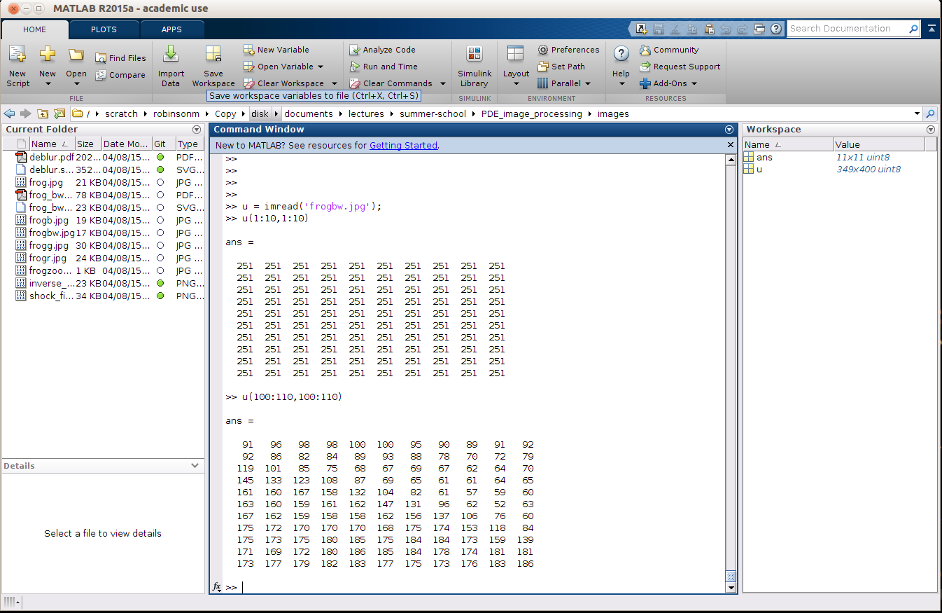

% Isotropic Diffusion
% Martin Robinson
% August 10, 2015

# Image Domain

# Opening Image in MATLAB

# Color Images

# Image Domain

- Image domain $\Omega = \{x,y \in \mathbb{R}^+: x < L_x \wedge y < L_y\}$

- "Perfect" digital image $u_{i,j}$

\begin{align}
u_{ij} = u(x_i,y_i) \\
x_i = i-0.5 \\
y_j = j-0.5
\end{align}

- Real images consist of both a source and noise term $n$

\begin{equation}
u_{i,j} = u(x_i,y_i) + n(x_i,y_i)
\end{equation}

- Goal is to recover $u(x,y)$ from set of noisy pixel values $u_{i,j}$

# Signal Processing - Fourier Domain

- We can examine our image in the frequency domain using a *fourier transform* 
  ($\mathcal{F}(f) = \hat{f}$), defined as

$$
\hat{f}(k) = \int_{-\infty}^{\infty} f(x) e^{-ikx} dx
$$

where $k$ is the mode frequency in units of radians per unit length

- In two-dimensions

$$
\hat{f}(k_x, k_y) = \int_{-\infty}^{\infty} \int_{-\infty}^{\infty} f(x,y) 
e^{-i(k_x x + k_y y)} dx dy
$$

-----------------------------------------

# Signal Processing: Low-pass filter

- Assume that the noise term is comprised of mainly high frequency terms

- A low-pass filter is a filter that removes or attenuates some of the higher 
  frequency components of the original signal.

- A low-pass filter can be implemented by convolution of the pixel values by a 
  function $f$. 

$$
(f \star u)(x) = \int_{-\infty}^{\infty} f(x-x')u(x')dx'
$$

- A common low-pass filter is the \emph{Gaussian} filter, which uses a gaussian 
  function for $f$

$$
f(x) = \frac{1}{\sqrt{2 \pi} \sigma} e^{-\frac{x^2}{2\sigma^2}}
$$

# Frequency response of gaussian low-pass filter

- Fourier transform of a guassian (**exercise**)

$$
\hat{f}(k) = e^{-\frac{k^2}{2\sigma^2}}
$$

- Convolution property of fourier transform (**exercise**)

$$
\mathcal{F}\{f(x) \star g(x)\} = \hat{f}(k)\hat{g}(k)
$$

Using the convolution property and the fourier transform of a guassian, it can 
be seen that the application of a gaussian filter attenuates the frequency 
components of the original image by a gaussian. i.e. a low-pass filter

# The heat equation

- Another option is to remove the noise term by applying a numerical 
  discritisation of the *diffusion equation*.

- In one-dimension is given by

$$
\left\lbrace \begin{array}{c}
u_t(x,t) = D u_{xx}(x,t) \\
u(x,0) = u_0(x)
\end{array}
\right.
$$

- Speed of evolution $u_t$ is proportional to the concavity $u_{xx}$.

- i.e. small features (with high $u_{xx}$) will be smoothed out first.

# Fundamental solution

- fourier transform of heat equation (**exercise**)

\begin{align}
\mathcal{F}\{u_t(x,t)\} &= \mathcal{F}\{D u_{xx}(x,t)\} \\
\hat{u}_t &= -D k^2 \hat{u}.
\end{align}

- therefore $\hat{u}(k) = C(k) e^{-k^2Dt}$

- use $\hat{u}(k,0) = \hat{u}_0(k) = C(k)$ to obtain (**exercise**)

$$
u(x,t) = \frac{1}{\sqrt{4 \pi D t}}  \int_{-\infty}^{\infty} u_0(x') 
e^{-\frac{(x-x')^2}{4Dt}} dx'
$$

- Note that this is the same as the gaussian low-pass filter with $\sigma = 
  \sqrt{2Dt}$.

# Finite Differences (forward time, central space)

- time derivative:

$$
u_t(x_{i},t_n) \approx \frac{u^{n+1}_i-u^{n}_i}{\Delta t}
$$

- space derivative:

$$
u_{xx}(x_i,t_n) \approx \frac{1}{{\Delta x}^2} (u^n_{i+1} - 2u^n_{i} + 
u^n_{i-1}) = u^n_{i+1} - 2u^n_{i} + u^n_{i-1}
$$

- put them together: (**exercise**)

$$
u^{n+1}_i = \Delta t D u^n_{i+1} + (1-2\Delta t D)u^n_{i} + \Delta t D u^n_{i-1}
$$

# Boundary Conditions

- We might want to set a dirichlet boundary condition as the initial pixel 
  values at the edges.

\begin{align}
u(0,t) = u_0(0)\\
u(L,t) = u_0(L).
\end{align}

- A zero-Neumann b.c. is often used to ensure that the gradient of the image 
  pixels at the boundary is zero. 

\begin{align}
\frac{\partial u}{\partial x}(0)=0\\
\frac{\partial u}{\partial x}(L)=0
\end{align}

----------------------------------

This could be implemented, for example, by having a set of "mirror" pixels surrounding the image.

\begin{align}
u_{0,j} &= u_{1,j}\\
u_{L+1,j} &= u_{L,j}
\end{align}

# 2D Heat Equation

$$
\left \lbrace \begin{array}{c}
u_t(x,y,t) = D (u_{xx}(x,y,t) + u_{yy}(x,y,t)) \\
u(x,y,0) = u_0(x,y)
\end{array}
\right.
$$

# Finite Differences (forward time, central space)

- time derivative:

$$
u_t(x_{i},y_{j},t_n) \approx \frac{u^{n+1}_{i,j}-u^{n}_{i,j}}{\Delta t}
$$

- spatial derivatives:

$$
u_{xx}(x_{i},y_{j},t_n) \approx \frac{1}{{\Delta x}^2} (u^n_{i+1,j} - 2u^n_{i,j} 
+ u^n_{i-1,j}) = u^n_{i+1,j} - 2u^n_{i,j} + u^n_{i-1,j}
$$

$$
u_{yy}(x_{i},y_{j},t_n) \approx \frac{1}{{\Delta y}^2} (u^n_{i,j+1} - 2u^n_{i,j} 
+ u^n_{i,j-1}) = u^n_{i,j+1} - 2u^n_{i,j} + u^n_{i,j-1} 
$$

------------------------------------------

- putting them together:

$$
u^{n+1}_i = \Delta t D (u^n_{i+1,j} + u^n_{i-1,j} + u^n_{i,j+1} + u^n_{i,j-1}) 
+ (1-4\Delta t D)u^n_{i,j}
$$

