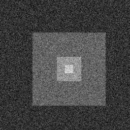

% Anisotropic Diffusion
% Martin Robinson
% August 11, 2015

# Image Domain

# Anisotropic Diffusion

- Motivation: diffusion parameter $D$ is constant over the entire domain. While 
  this smooths out noise, it also smooths out image features, most notably edges 

- Goal: we wish to reduce diffusion across (or perpendicular) to the edge while 
  keeping normal diffusion along (tangential) to the edge. 
 

 
# New coordinate system near edge

- The unit vector $N$ normal to $\Gamma$ and the tangential vector $T$ are given 
  by

\begin{align*}
N &= \frac{1}{|\nabla{u}|} \nabla{u} = \frac{1}{|\nabla{u}|}\begin{pmatrix} u_x \\u_y \end{pmatrix} \\
T &= N^\perp = \frac{1}{|\nabla{u}|}\begin{pmatrix} -u_y \\u_x \end{pmatrix}
\end{align*}

- We can then define the first and second derivatives of $u$ with respect
to $N$ and $T$.

\begin{align*}
u_N &= N \cdot \nabla u,\\
u_{NN} &= N \cdot H(u) N,\\
u_T &= T \cdot \nabla u,\\
u_{TT} &= T \cdot H(u) T,\\
\end{align*}

where $H(u)$ is the hessian matrix of $u$

\begin{align*}
H(u) = \begin{pmatrix} u_{xx} & u_{xy} \\ u_{xy} & u_{yy} \end{pmatrix}
\end{align*}

# Anisotropic diffusion tensor

- Define new diffusion constant to be used in the coordinate system of $N$ and 
  $T$

$$
K = \begin{pmatrix} \alpha & 0 \\ 0 & \beta \end{pmatrix}.
$$

- Defining $\nabla u = \begin{pmatrix}u_N \\ u_T \end{pmatrix}$, the heat 
  equation becomes

\begin{align*}
u_t &= \nabla \cdot (K\nabla u) = \nabla \cdot \left ( \begin{pmatrix} \alpha & 0 \\ 0 & \beta \end{pmatrix} \begin{pmatrix} u_N \\ u_T \end{pmatrix} \right )\\ 
u_t &= \alpha u_{NN} + \beta u_{TT}
\end{align*}

------------------------------

- (**exercise**) The above in terms of $x$ and $y$ derivatives is

$$
u_t = \frac{A u_{xx} + B u_{xy} + C u_{yy}}{u_x^2 + u_y^2},
$$

where

\begin{align*}
A &= \alpha u_x^2 + \beta u_y^2 \\
B &= (\alpha-\beta) u_x u_y \\
C &= \beta u_x^2 + \alpha u_y^2
\end{align*}

# Finite Difference

- We can discritize the single derivatives using a \emph{central difference} 
  $D_c^x u \approx u_x$

$$
u_x \approx D_c^x u = \frac{u_{i+1,j}-u_{i-1,j}}{2\Delta x}
$$

- The mixed derivative $u_{xy}$ can be constructed by using the central 
  difference operator twice on $x$ and $y$

\begin{align*}
u_{xy} &= (u_x)_y \approx D_c^y (D_c^x u)
 &= \frac{u_{i+1,j+1}-u_{i-1,j+1} - u_{i+1,j-1} + u_{i-1,j-1}}{4\Delta x \Delta 
 y}.
\end{align*}

----------------------------------

- Note: can derive $u_{xx}$ and $u_{yy}$ using a combination of \emph{forward 
  difference} $D_+^x$ and \emph{backwards difference} $D_-^x$ operators.

\begin{align*}
u_{xx} &\approx D_-^x (D_+^x u) = \frac{u_{i+1,j}-2u_{i,j} +u_{i-1,j}}{\Delta 
x^2}
u_{yy} &\approx D_-^y (D_+^y u) = \frac{u_{i,j+1}-2u_{i,j} +u_{i,j-1}}{\Delta 
y^2}
\end{align*}

---------------------------------

**MATLAB code**

# Spatially varying diffusion

- Diffusion flux at point $(x,y)$

$$
J(x,y) = K(x,y)\nabla u
$$

- Heat equation becomes

\begin{align*}
u_t &= \nabla \cdot J(x,y), \\
&= \nabla \cdot (K(x,y) \nabla u).
\end{align*}

# Spatially varying diffusion - 1D

- In one dimension, this would be

\begin{align}
u_t = (K(x) u_x)_x.
\end{align}

- A common approach to discretizing this is to use a *forward difference* $D_+^x 
  \approx u_x$ on the $u_x$ term, evaluate $K(x)$ at the midpoint: 
  $K(x_{i+\frac{1}{2}})$, and then use a *backwards difference* to calculate the 
  outside gradient. i.e.

\begin{align}
(K(x) u_x)_x &\approx D_-^x(K(x_{i+\frac{1}{2}}) D_+^xu) = 
\frac{K(x_{i+\frac{1}{2}})\frac{u_{i+1}-u_{i}}{\Delta x} - 
K(x_{i-\frac{1}{2}})\frac{u_{i}-u_{i-1}}{\Delta x}}{\Delta x} \\
&\approx \frac{ K(x_{i+\frac{1}{2}}) u_{i+1} - 
(K(x_{i+\frac{1}{2}})+K(x_{i-\frac{1}{2}}))u_{i} + 								
K(x_{i-\frac{1}{2}}) u_{i-1} }{\Delta x^2}
\end{align}

- What is this for constant diffusion $K(x)=K$?

# Spatially varying diffusion - 2D

For two dimensions, the spatially varying heat equation is

$$
u_t = (K(x,y) u_x)_x + (K(x,y) u_y)_y.
$$

- this can be discretized in a similar fashion to give 

\begin{align}
(K(x,y) u_x)_x &\approx \frac{ K(x_{i+\frac{1}{2}},y_j) u_{i+1,j} - 
(K(x_{i+\frac{1}{2}},y_j)+K(x_{i-\frac{1}{2}},y_j))u_{i,j} + 								
K(x_{i-\frac{1}{2}},y_j) u_{i-1,j} }{\Delta x^2} \\
(K(x,y) u_y)_y &\approx \frac{ K(x_{i},y_{j+\frac{1}{2}}) u_{i,j+1} 
-(K(x_{i},y_{j+\frac{1}{2}})+K(x_{i},y_{j-\frac{1}{2}}))u_{i,j} + 								
K(x_{i},y_{j-\frac{1}{2}}) u_{i,j-1} }{\Delta y^2} \\
u_t &\approx \frac{u^{n+1} - u^n}{\Delta t}.
\end{align}

----------------------------------

- If only the nodal values for $K(x,y)$ are known, then a reasonable 
  approximation is to use the average of two neighbouring grid points

\begin{align}
K(x_{i},y_{j+\frac{1}{2}}) &= \frac{1}{2} (K_{i,j+1}+K_{i,j}) \\
K(x_{i+\frac{1}{2}},y_{j}) &= \frac{1}{2} (K_{i+1,j}+K_{i,j})
\end{align}

------------------------------------

- Which results in 

\begin{align}
(K(x,y) u_x)_x &\approx \frac{ (K_{i+1,j}+K_{i,j}) u_{i+1,j} - 
			    ( (K_{i+1,j}+2K_{i,j}+K_{i-1,j}))u_{i,j} + 								 (K_{i-1,j}+K_{i,j}) u_{i-1,j} }{2\Delta x^2} \\
(K(x,y) u_y)_y &\approx \frac{ (K_{i,j+1}+K_{i,j}) u_{i,j+1} - 
			    ( (K_{i,j+1}+2K_{i,j}+K_{i,j-1}))u_{i,j} + 								 (K_{i,j-1}+K_{i,j}) u_{i,j-1} }{2\Delta y^2} \\
u_t &\approx \frac{u^{n+1} - u^n}{\Delta t}.
\end{align}

------------------------------------

For $\Delta x = \Delta y = 1$ this simplifies to

\begin{align}
u^{n+1}_{i,j} = &u^{n}_{i,j} + \frac{1}{2}\Delta t (\\
& (K_{i+1,j}+K_{i,j}) u_{i+1,j}  + (K_{i-1,j}+K_{i,j}) u_{i-1,j} \\
& (K_{i,j+1}+K_{i,j}) u_{i,j+1}  + (K_{i,j-1}+K_{i,j}) u_{i,j-1} \\
& - (K_{i+1,j}+K_{i-1,j}+K_{i,j+1}+K_{i,j-1}+4K_{i,j} )u_{i,j})
\end{align}

