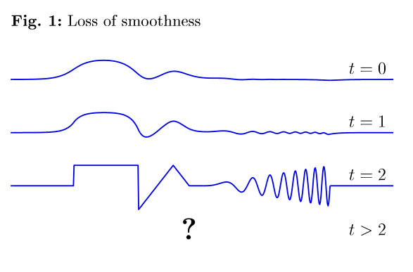
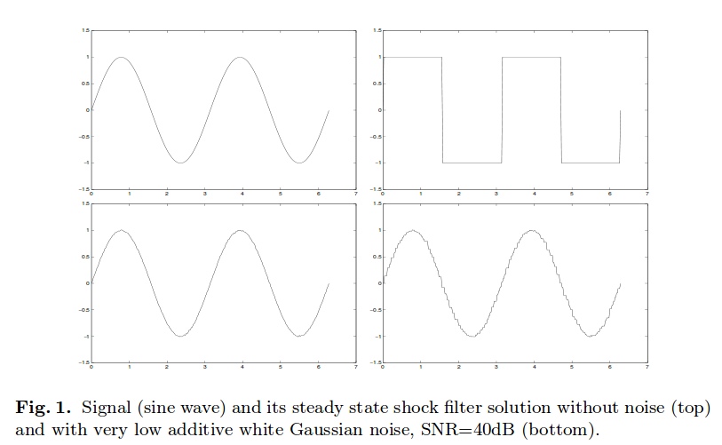

% The Osher and Rudin Shock Filter
% Martin Robinson
% August 29, 2014

# Transport Equation
- Transport or first-order wave equations
$$u_t(x,t) + cu_x(x,t) = 0 \qquad -\infty < x < \infty, t > 0$$
$$u(x,0) = \phi(x), \qquad -\infty < x < \infty$$
- $c$ is a wave speed or speed of information propogation
- If $c > 0$, the information will propagate or transport to the right (positive $x$-direction); if $c < 0$ the information will propagate to the left.

# Characteristics
- Quantity $cu_x + u_t$ is the directional derivative of $u$ with direction $\mathbf{d}=(c,1)$.
- In other words, $u$ is constant along $\mathbf{d}$, and all line parallel
- These are \emph{characteristic lines}. Parametric equation: $x - ct = x_0$
- Solution is $u(x,t) = f(x-ct)$
- $f(x)$ determined by initial conditions: $u(x,0) = f(x) = \phi(x)$, therefore $u(x,t) = \phi(x-ct)$

# Variable $c(x,t)$
- Variable wave speed, with $x$ and $t$
$$u_t(x,t) + c(x,t)u_x(x,t) = 0 \qquad -\infty < x < \infty, t > 0$$
$$u(x,0) = \phi(x), \qquad -\infty < x < \infty$$
- Characteristic \emph{curves}
$$\frac{dx(t)}{dt} = c(x(t),t), \qquad \text{with some initial condition} \qquad x(0) = x_0$$
- Calculate time derivative along these curves
$$\frac{d}{dt} u(x(t),t) = \frac{\partial u}{\partial x}\frac{\partial x}{\partial t} + \frac{\partial u}{\partial t} = 0$$
- Therefore $u$ is constant along characteristic curves and 
$$u(x(t),t) = u(x_0,0) = \phi(x_0)$$

# Edge Enhancing
- The heat equation blurs or smoothes out edges
- Could we enhance edges or reverse smoothing by using inverse heat equation (i.e. replace $t$ by $-t$)?
$$u_t = -D \nabla^2 u$$

# Edge Enhancing

# Edge Enhancing
- Turns out we can, but very unstable
- Small perterbations increase exponentially
- ill-posed since no continuous dependence on initial data
	
	\tiny{"The (unfinished) PDE coffee table book" by Lloyd N. Trefethen and Kristine Embree, editors, Unpublished, 2001}

# Shock Filtering using Transport Equation
- Want to use a Transport equation to enhance image features (edges)
- How can we chose $c(x,t)$ to do this?
- One option: shock filters
- Shock filter model proposed in 90s by Osher and Rudin:
  *Osher, Stanley, and Leonid I. Rudin. "Feature-oriented image enhancement using shock filters." SIAM Journal on Numerical Analysis 27.4 (1990): 919-940.*
- Good for edge enhancement. Not useful when noise is a problem (diffusion-based filters better for noisy image)

# Osher and Rudin Shock Filters
- Transport equation with $c(x,t)$ using the sign of the Laplacian
$$u_t = -sign(\nabla^2u)|\nabla u|$$
$$u(x,0) = \phi(x)$$
- When Laplacian is negative, transport of $u$ is towards increasing $x$
$$u_t = |\nabla u|$$
- When Laplacian is positive, transport of $u$ is towards decreasing $x$
$$u_t = -|\nabla u|$$

# Osher and Rudin Shock Filters
- Why the absolute value of $\nabla u$? Consider Tranport equation defined using local coordinate system based on $N$ and $T$
$$u_t = c(x,t) \nabla_N u + d \nabla_T u$$
- Only want transport normal to edge, so set $d=0$. Using $\nabla_N = N\cdot \nabla$ and $N= \nabla u / |\nabla u|$:
$$u_t = c(x,t) \frac{\nabla u \cdot \nabla u}{ |\nabla u|} = c(x,t)  |\nabla u|$$

# Choices for $c(x,t)$
- Can be based on image values (non-linear) or initial conditions (linear)
$$c(x,t) = sign[u_{NN}(x,t)]$$
$$c(x) = sign[\phi_{NN}(x)]$$
- Can pre-smooth image with a Guassian kernel $K_\sigma$ with standard deviation $\sigma$.
$$c(x,t) = sign[(K_\sigma * u)_{NN}(x,t)]$$
- Pre-smoothing with $K_\sigma$ can give erroneous results for some patterns, e.g. parallel lines. Instead, can use *structure tensor*
$$J_0(\nabla u) = \nabla u \nabla u^T$$
- Eigenvectors of $J_0$ give local coordinate system of edge (normal and tangent). Can then smooth to get average orientations
$$J_0(\nabla u) = K_\sigma * \nabla u \nabla u^T$$

# Discritisation
- Expand out Laplacian with $N$
$$ u_{NN} = \frac{u_x^2 u_{xx} + 2 u_x u_y u_{xy} + u_y^2 u_{yy}}{u_x^2+u_y^2}$$
Can drop denominator since we are only interested in the sign
- Discretisation of $u_{NN}$ proceeds as per anisotropic diffusion notes
- Discretisation of $|\nabla u|$ more difficult as gradient can grow unbounded due to formation of shock. Need a *flux limiter*
$$|\nabla u| \approx \sqrt{m(D_+^x u,D_-^x u)^2 + m(D_+^y u,D_-^y u)^2}$$
where
$$m(x,y) = \begin{cases} sign[x] min(|x|,|y|) & xy > 0  \\ 0 & xy \le 0. \end{cases}$$
is the *minmod* flux limiter. Many others...

# Shock Filter Properties
- Shocks develop at inflection points ($\nabla^2u=0$)
- Local extrema remain unchanged in time. No new local extrema are created.
- The steady state solution is piece-wise constant with discontinuities at inflection points
- Shock filter approximates inverse heat equation

# Shock Filter Properties
- Classic version (no pre-smoothing or structure tensor) very sensitive to noise. Any noise is also enhanced by the filter

\tiny{G. Gilboa, N. Sochen, Y.Y. Zeevi, "Regularized Shock Filters and Complex Diffusion", ECCV 2002, LNCS 2350, pp. 399-313, Springer-Verlag 2002.}

